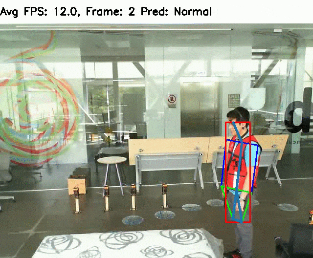

# DetectionOfDeviantBehavior
We augment human pose estimation
(openpifpaf library) by support for multi-camera and multi-person tracking and a long short-term memory (LSTM)
neural network to predict two classes: “Fall” or “No Fall”. From the poses, we extract five temporal and spatial
features which are processed by an LSTM classifier.
<p align="center">

</p>

## Setup

```shell script
pip install -r requirements.txt
```

## Usage
```shell script
python3 fall_detector.py
```